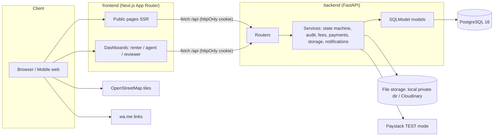
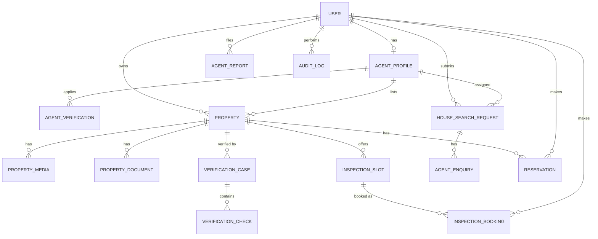
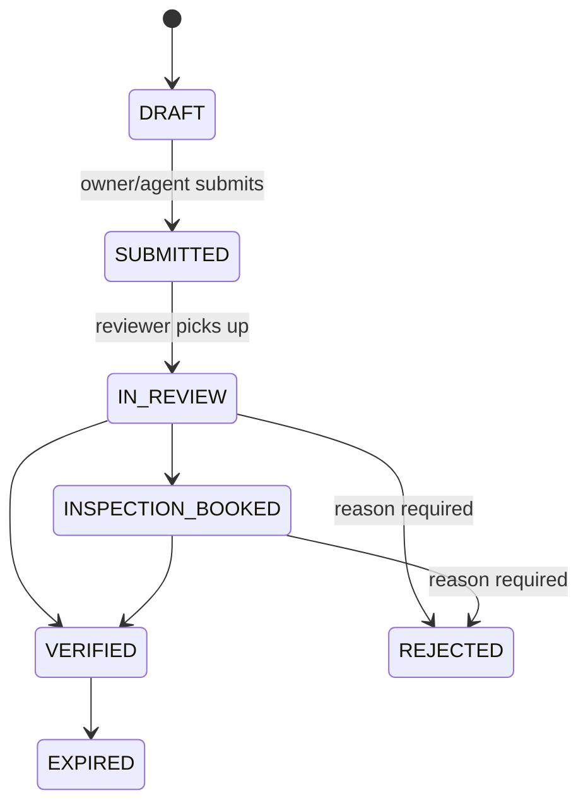
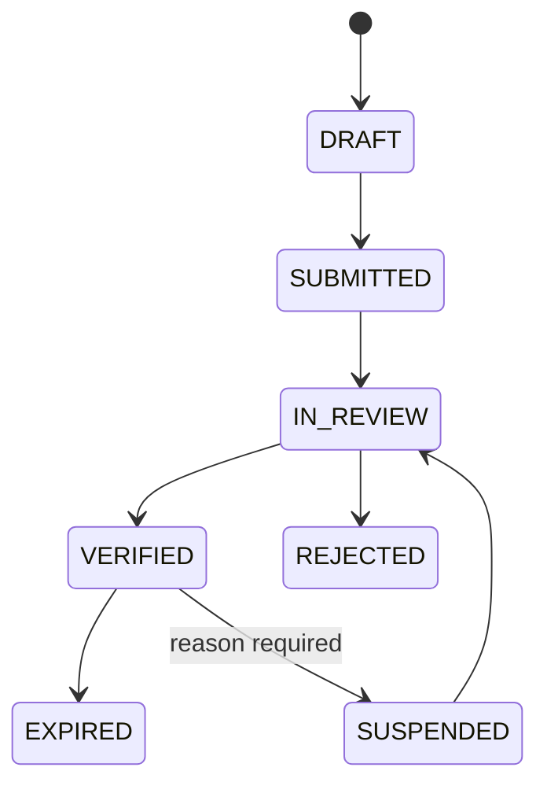
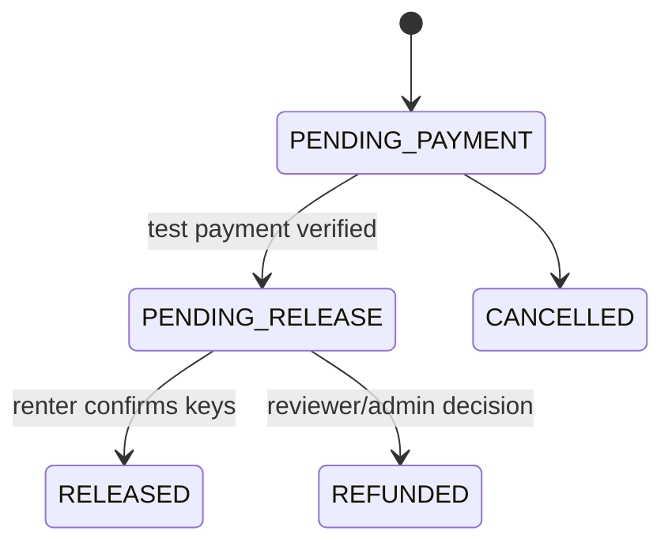

# PropCheck Nigeria - Architecture

> "Verify the property and agent before you pay rent."
>
> PropCheck verifies the documents, identity information and inspection evidence listed in this report. It is not a substitute for a formal title search, legal advice or an official land-registry search. Users should verify payment terms before sending money.

## 1. System overview

PropCheck is a two-sided web platform:

- **Find a verified agent** - renters search agents by state/city/property type, contact them (call/WhatsApp, consent-gated) or submit a house-search request.
- **Verify a property before payment** - agents/landlords submit listings; a human reviewer checks identity, authority to market, location, photos, fees and inspection evidence, and issues a dated, expiring verification report.

Agent verification and property verification are **independent workflows**. A Verified Agent badge never implies that the agent's listings are verified.



## 2. Technology stack

| Layer | Choice | Notes |
|---|---|---|
| Frontend | Next.js (App Router), TypeScript, Tailwind CSS, shadcn/ui | Mobile-first, SSR for public/SEO pages |
| Forms | React Hook Form + Zod | Zod schemas mirror backend Pydantic validation |
| Maps | Leaflet + react-leaflet + OpenStreetMap | Client-only component (dynamic import) |
| Backend | FastAPI, Python 3.12 (Docker) / 3.11+ | OpenAPI docs at `/docs` |
| ORM / migrations | SQLModel (SQLAlchemy 2) + Alembic, psycopg 3 | |
| Database | PostgreSQL 16 | `btree_gist` extension for slot-overlap exclusion |
| Auth | JWT in httpOnly, SameSite=Lax cookie; Bearer accepted for tests/docs | Passwords hashed with argon2/bcrypt via `pwdlib` |
| Payments | Paystack **test mode only** + simulated fallback | Live keys refused at startup |
| Files | Storage abstraction: local private dir (default) / Cloudinary-compatible | Signed, short-lived URLs for private docs |
| Notifications | `NotificationService` interface, console implementation | Email/SMS providers are TODO |
| Infra | Docker Compose (db, api, web), `.env.example` | |
| Tests | pytest (+ httpx TestClient) backend; Vitest + Testing Library frontend | |

## 3. Repository layout

```
PropCheck-Nigeria/
├── docker-compose.yml
├── .env.example
├── README.md  RESEARCH.md  LOG.md
├── docs/
│   ├── ARCHITECTURE.md   API.md   DEPLOYMENT.md
├── backend/
│   ├── Dockerfile  pyproject.toml  alembic.ini
│   ├── alembic/versions/0001_initial.py
│   ├── app/
│   │   ├── main.py            # app factory, CORS, routers, error handlers
│   │   ├── config.py          # pydantic-settings, env vars
│   │   ├── db.py              # engine, session dependency
│   │   ├── deps.py            # current_user, require_roles(...)
│   │   ├── security.py        # hashing, JWT, cookie helpers
│   │   ├── reference/         # Nigerian states, cities, LGAs (data, not tables)
│   │   ├── models/            # 15 SQLModel tables + enums
│   │   ├── schemas/           # Pydantic I/O models (public vs private views)
│   │   ├── services/
│   │   │   ├── state_machine.py   # generic transition engine
│   │   │   ├── workflows.py       # per-entity transition tables + guards
│   │   │   ├── audit.py
│   │   │   ├── fees.py
│   │   │   ├── payments.py        # Paystack test / simulated
│   │   │   ├── storage.py         # local + Cloudinary adapters, signed URLs
│   │   │   ├── notifications.py   # stub
│   │   │   └── ratelimit.py
│   │   ├── routers/           # auth, properties, agents, reviewer, house_search,
│   │   │                      # enquiries, verification, inspections,
│   │   │                      # reservations, reports, files, reference
│   │   └── seed.py
│   ├── scripts/e2e_journey.py
│   └── tests/
└── frontend/
    ├── src/app/               # routes (see §9)
    ├── src/components/        # badges, fee-breakdown, verification-report,
    │                          # disclaimer, safety-warning, filter-drawer, map
    ├── src/lib/               # api.ts, format.ts (₦, +234), whatsapp.ts, auth.ts
    └── tests/
```

## 4. Domain model

### 4.1 Entities (17 tables)

| Table | Purpose | Key relations |
|---|---|---|
| `user` | Account + role (RENTER, AGENT, LANDLORD, REVIEWER, ADMIN) | — |
| `agent_profile` | Public agent/agency profile, coverage, consent flags, current verification status | `user_id → user` (1:1) |
| `agent_verification` | One verification application per submission (history kept) | `agent_profile_id`, `submitted_by`, `assigned_reviewer_id` |
| `property` | Listing, location, fees, availability, `public_slug` | `owner_user_id`, `listing_agent_id → agent_profile` |
| `property_media` | Photos (public) | `property_id` |
| `property_document` | Supporting documents (private), review status UPLOADED/REVIEWED/ACCEPTED/REJECTED | `property_id`, `uploaded_by` |
| `verification_case` | Property verification case, reference `PCV-YYYY-NNNNN`, dates, expiry | `property_id`, `submitted_by`, `assigned_reviewer_id` |
| `verification_check` | One checklist item result per case | `verification_case_id`, `completed_by` |
| `inspection_slot` | Bookable time window for a property | `property_id`, `landlord_user_id` |
| `inspection_booking` | Renter booking of a slot | `slot_id`, `property_id`, `renter_id` |
| `house_search_request` | "I need help finding a house" | `renter_id`, `assigned_agent_id` |
| `agent_enquiry` | Agent's response/thread on an assigned request | `house_search_request_id`, `agent_id` |
| `reservation` | Test/demo reservation + payment reference | `property_id`, `renter_id` |
| `agent_report` | Report against an agent and/or property | `reporter_id`, `agent_id?`, `property_id?` |
| `audit_log` | Append-only record of every important action | `actor_user_id`, polymorphic `entity_type` + `entity_id` |
| `nearby_place` | Market / restaurant / church / club near listings (informational, not verified) | indexed `(latitude, longitude)` |
| `place_report` | A user's report that a nearby place is wrong | `nearby_place_id`, `reporter_id` |



### 4.2 Modelling decisions
- **Money** stored as integer naira (`BIGINT`); `total_move_in_cost = rent + agency + legal + caution + other`, computed server-side on every create/update (`services/fees.py`), never trusted from the client.
- **Coverage lists** (`states_covered`, `cities_covered`, `property_types`, `service_types`) are Postgres `ARRAY(TEXT)` with GIN indexes for filtering.
- **Locations** live in `app/reference/` as data: State → City → Area, each area with its LGA and approximate coordinates. Only `ACTIVE_STATES` (Lagos, Rivers, Enugu, Anambra, Imo) are offered or accepted; Port Harcourt is flagged as the major city of Rivers. Adding a state needs no migration. Properties and house-search requests store `state`, `city`, `area` and `local_government_area`.
- **Effective verification status**: a `VERIFIED` record whose `expires_at < now()` is always presented as `EXPIRED` (computed property used by every public schema). A reviewer action can also persist `EXPIRED`.
- **Document trust**: uploading sets `UPLOADED`; only a reviewer can move it to `REVIEWED/ACCEPTED/REJECTED`. The report lists documents by review status, never "verified" merely because uploaded.
- **Audit log** is append-only (no update/delete endpoints) with `from_status`, `to_status`, `reason`, `metadata_json`.

## 5. Workflow state machines

### 5.1 Engine (`services/state_machine.py`)
Transitions are **data**, not scattered `if` statements:

```python
TransitionRule(from_status, to_status, allowed_roles, guards=[...], on_apply=fn)
```

`transition(session, entity, to_status, actor, reason=None, metadata=None)` does, inside one DB transaction:

1. `SELECT … FOR UPDATE` on the entity row (serialises concurrent attempts).
2. Look up `(current, to)`; if absent → `InvalidTransition` (HTTP 409). Repeating a terminal action (second release/refund) fails here — this is the duplicate-operation guarantee.
3. Check actor role ∈ `allowed_roles` (HTTP 403).
4. Run guards - ownership, "actor is not the submitter", "reviewer is not the agent's own user", reason required for rejections, etc.
5. Apply status + side-effect timestamps (`verified_at`, `expires_at`, `released_at`…).
6. Insert `audit_log` row.
7. Commit; on any exception, roll back everything (no partial updates).

### 5.2 Transition tables

**VerificationCase** — reviewer/admin only after submission; submitter can never approve own case.

REJECTED is terminal; re-verification requires a **new case**.
VERIFIED requires all mandatory checklist items PASSED or NOT_APPLICABLE, and an expiry date (default 6 months).

**AgentVerification / AgentProfile status**


**InspectionBooking**: REQUESTED → CONFIRMED | DECLINED | CANCELLED; CONFIRMED → COMPLETED | CANCELLED.
Confirm/decline/complete: property owner or listing agent. Cancel: renter (or owner).

**Reservation**

RELEASED, REFUNDED, CANCELLED are terminal — no RELEASED→REFUNDED, REFUNDED→RELEASED or duplicate release/refund.

**HouseSearchRequest**: SUBMITTED → MATCHING → ASSIGNED → CONTACTED → COMPLETED; cancel allowed from SUBMITTED, MATCHING, ASSIGNED.

**Reports**: OPEN → IN_REVIEW → RESOLVED | REJECTED (reviewer, reason required; may trigger agent SUSPENDED via the agent state machine).

## 6. Authentication and authorisation

- Register/login issue a JWT (sub, role, exp 24h) in an httpOnly, `Secure` (prod), `SameSite=Lax` cookie. Logout clears it.
- `deps.current_user` resolves the user; `require_roles(*roles)` guards routers.
- **Ownership checks** in services (not just routers): agents see only their own properties, slots, bookings on their properties, reservations on their properties, and enquiries assigned to them.
- Reviewer-conflict rule: a reviewer/admin cannot act on a case/agent application where they are the submitter or the agent's user.

| Capability | Renter | Agent/Landlord | Reviewer | Admin |
|---|:-:|:-:|:-:|:-:|
| Browse properties/agents/reports | ✓ | ✓ | ✓ | ✓ |
| House-search request, booking, reservation, confirm keys | ✓ | | | |
| Manage own profile, listings, docs, slots, bookings | | ✓ | | |
| Review agents/properties, checklists | | | ✓ | ✓ |
| Assign requests, manage reports, refund | | | ✓ | ✓ |
| Platform-wide audit log & data | | | ✓ | ✓ |

## 7. Concurrency and integrity guarantees

| Risk | Mechanism |
|---|---|
| Overlapping slots for one property | Postgres `EXCLUDE USING gist (property_id WITH =, tstzrange(start_time, end_time) WITH &&)` + app pre-check for a friendly 409 |
| Two renters booking one slot | Partial unique index `inspection_booking(slot_id) WHERE status IN ('REQUESTED','CONFIRMED')` + slot row lock |
| Duplicate payment | Unique `payment_reference`; pay allowed only from PENDING_PAYMENT under row lock; Paystack verify is idempotent |
| Duplicate release/refund | State machine row lock + terminal states |
| Partial updates | One transaction per command; audit row written in the same transaction |

## 8. API design

REST under `/api`, JSON, documented by FastAPI OpenAPI (`/docs`) and summarised in `docs/API.md`. Groups:

- **Auth**: `/api/auth/{register,login,logout,me}`
- **Properties**: list/search, CRUD, `/media`, `/documents`, `/verification-report`, `/share`
- **Agents**: directory, profile CRUD, `/profile/verification`, `/{id}/properties`
- **Reviewer**: `/api/reviewer/agents/*` (approve/reject/suspend/expire), `/api/reviewer/reports/*`
- **House search**: create/list/get, `assign`, `contacted`, `complete`, `cancel`, `respond`; `/api/agent/enquiries`
- **Verification**: create case, list/get, `submit`, `transition`, `checks`, `audit-log`
- **Inspections**: slots, bookings, `confirm/decline/complete/cancel`
- **Reservations**: create, `pay`, `confirm-keys`, `refund`, `cancel`, get
- **Reports**: `/api/agents/{id}/report`, `/api/properties/{id}/report`
- **Files**: `/api/files/{signed-token}` - private document download
- **Reference**: `/api/reference` - active states, city/area/LGA hierarchy, enums, disclaimer text
- **Nearby**: `/api/nearby-places?latitude&longitude&category&radius_km` (Haversine, nearest first, radius ≤ 10 km), `/api/nearby-places/{id}/report`, `/api/reviewer/place-reports`

Conventions: 401 unauthenticated, 403 wrong role/ownership, 404 not found *or* not visible (no existence leaks for private resources), 409 invalid transition/conflict, 422 validation. Public vs private response schemas are separate Pydantic classes so private fields cannot leak by accident.

## 9. Frontend architecture

- **Rendering**: public pages (`/`, `/properties`, `/properties/[slug]`, `/agents`, `/agents/[id]`, `/find-an-agent`, `/how-it-works`, `/pricing`, `/about`, `/report-problem`) are Server Components fetching the API; dashboards are server-rendered with small client islands for actions, and protected by `src/proxy.ts` (Next 16's renamed middleware: cookie present) plus a server-side role check via `/api/auth/me` in each dashboard layout. The browser calls the API through same-origin `/api/*` and `/media/*` rewrites, so the session cookie is first-party.
- **Route groups**: `(public)`, `(auth)` (`/login`, `/register`), `dashboard/renter/*`, `dashboard/agent/*`, `dashboard/reviewer/*`.
- **Shared components**: `VerifiedAgentBadge`, `VerifiedPropertyBadge`, `NotYetVerifiedBadge` (distinct colours/text), `FeeBreakdown`, `VerificationReport` (checked / not checked / documents / dates / reviewer ref / limitations), `Disclaimer`, `SafetyWarning` ("Do not send money before confirming the property, agent authority and payment terms."), `FilterDrawer` (mobile sheet), `PropertyMap` (Leaflet, dynamic import), `WhatsAppButton`.
- **Utilities**: `formatNaira` (`₦2,500,000` via `Intl.NumberFormat('en-NG')`), `formatNgPhone` (`+234 803 123 4567`), `waLink(number, text)` with `encodeURIComponent`.
- **States**: every list has loading skeleton, empty state, and error state.
- **Design tokens**: white/gray-50 surfaces, slate-900 text, green = verified, amber = pending, red = rejected/warning, rounded-xl cards, WCAG AA contrast.

## 10. Integrations

| Integration | MVP implementation | Boundary |
|---|---|---|
| Paystack | `PaymentProvider` interface → `PaystackTestProvider` (only `sk_test_` keys) or `SimulatedProvider` (reference `PCK-TEST-…`) | Never processes real money; UI states "test/demo reservation - not escrow" |
| File storage | `StorageBackend` → `LocalStorage` (private dir outside web root) / `CloudinaryStorage` | Docs served only via HMAC-signed URLs (10-min expiry) to owner/reviewers; photos public |
| Maps | Leaflet + OSM tiles; lat/lng on property | No geocoding API in MVP |
| WhatsApp | `https://wa.me/<234…>?text=<encoded>` links | Only when agent consented |
| Email/SMS | `NotificationService` console stub | TODO providers |
| Land registry / AI document analysis | **Not implemented** | Roadmap Phase 4; AI only ever assists human reviewers |

## 11. Security and privacy

- Argon2/bcrypt password hashing; password policy (≥8 chars, letter + digit).
- Pydantic + Zod validation on both sides; Nigerian phone normalisation to E.164.
- Role + ownership checks in the service layer.
- File uploads: allow-list of MIME types verified by magic bytes, size limits (images 5 MB, documents 10 MB), random storage names.
- Identity and business documents are never public; public schemas exclude document URLs.
- Agent phone/email shown only when `display_phone_publicly` / `display_email_publicly` is true.
- CORS restricted to `CORS_ORIGINS`; secrets only from env vars; live Paystack keys rejected.
- In-memory rate limit on login/register (documented placeholder for Redis-based limiter).
- Logging filter redacts `password`, `token`, `secret`, `authorization`; document contents never logged.
- Every approval, rejection, suspension, payment, release, refund and status change writes `audit_log`.

## 12. Key end-to-end flow

```mermaid
sequenceDiagram
  actor A as Agent
  actor Rv as Reviewer
  actor R as Renter
  participant API
  A->>API: register, create profile, submit agent verification
  Rv->>API: IN_REVIEW → VERIFIED (audit)
  A->>API: create property, upload photos/docs, open + submit case
  Rv->>API: checklist results, INSPECTION_BOOKED → VERIFIED (+expiry, audit)
  R->>API: search properties/agents (state, city, verified-only)
  R->>API: book inspection slot (lock + unique index)
  A->>API: confirm booking (audit)
  R->>API: create reservation → pay (Paystack test) → PENDING_RELEASE (audit)
  R->>API: confirm keys → RELEASED (audit); second release → 409
```

## 13. Deployment

- **Local**: `docker compose up` → `db` (postgres:16), `api` (uvicorn :8000, runs `alembic upgrade head` on start), `web` (Next.js :3000). Seed with `docker compose exec api python -m app.seed`.
- **Hosted (suggested)**: frontend on Vercel; API container on Render/Fly/Railway; managed Postgres; Cloudinary for media. Details in `docs/DEPLOYMENT.md`.
- Config via env (see `.env.example`): `DATABASE_URL`, `JWT_SECRET`, `FILE_SIGNING_SECRET`, `CORS_ORIGINS`, `API_PUBLIC_URL`, `FRONTEND_URL`, `PAYSTACK_SECRET_KEY`, `PAYSTACK_PUBLIC_KEY`, `STORAGE_BACKEND`, `CLOUDINARY_*`, and for the frontend `API_INTERNAL_URL` (also a build argument, because rewrites are compiled in).

## 14. Testing strategy

- **Backend (pytest)**: dedicated `propcheck_test` Postgres DB, schema created once, each test in a rolled-back transaction. Covers all 35 scenarios in the brief — auth, RBAC, ownership, every state machine (valid, invalid, duplicate, self-approval), audit creation, slot overlap and double booking, reservation release/refund-once, fee totals, expiry display, report handling, document privacy, validation, no partial updates on failure.
- **Frontend (Vitest + Testing Library)**: naira/phone formatting, WhatsApp link encoding, badge selection (agent vs property vs not-yet-verified, expired), phone hidden without consent, fee breakdown totals.
- **E2E**: `backend/scripts/e2e_journey.py` drives the full journey via HTTP against the running stack.
- **Static checks**: ruff, `tsc --noEmit`, `next lint`, `next build`.

## 15. Extension points for the roadmap

| Future feature | Where it plugs in |
|---|---|
| Rent reminders, tenant records, maintenance (Phase 2–3) | New `tenancy`, `maintenance_request` modules reusing the state-machine engine and audit log |
| Rent collection, landlord accounting | Additional `PaymentProvider` methods + ledger tables; requires legal/regulatory review before real money |
| Agency team accounts, agent permissions | `agency` + `agency_member` tables; RBAC extended with scoped roles |
| Automated agent matching | Service replacing manual `assign` using coverage arrays + budget |
| Land-registry integrations | New `RegistryProvider` interface feeding `verification_check` evidence |
| AI document analysis | Reviewer-assist service attaching suggestions to `verification_check.evidence_note`; never auto-approves |
| Multi-state expansion | Add entries to `app/reference/` — no schema change |

## 16. Nearby places

- **Data**: `nearby_place` rows (name, category MARKET/RESTAURANT/CHURCH/CLUB, address, state/city/LGA/area, lat/lng, phone, website, opening hours, `is_active`, `source`). The MVP seeds ~330 fictional places (`source = DEMO_SEED`) around every neighbourhood in the five states, so demos never need a network call.
- **Provider abstraction** (`services/nearby.py`): `NearbyProvider.search(lat, lng, radius_km, category, limit)`. `DatabaseNearbyProvider` filters with an indexed latitude/longitude bounding box in SQL, then computes exact Haversine distances in Python, drops anything outside the circle and sorts nearest first. A future Overpass/OSM provider plugs in behind `get_provider()`.
- **Limits**: default radius 3 km, maximum 10 km (`NEARBY_MAX_RADIUS_KM`), at most 50 results.
- **Privacy**: responses omit internal fields (`is_active`, `source`, timestamps). The map shows the property as an approximate 250 m area, not a pin.
- **Display**: under 1 km in metres (nearest 10 m), otherwise km to one decimal. "Get directions" opens Google Maps directions from the property. Every view shows the convenience notice, says places are not verified, and labels demo rows.
- **Corrections**: logged-in users report a place (`place_report`, one open report per user and place). Reviewers resolve or reject it with a reason, optionally hiding the place. Every step is audited.
